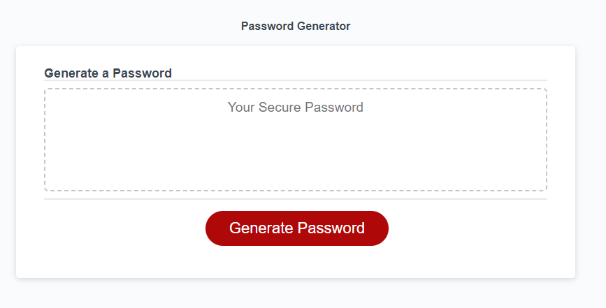
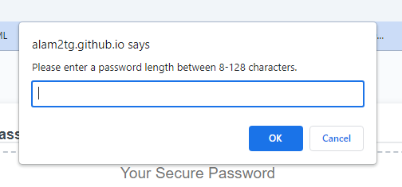
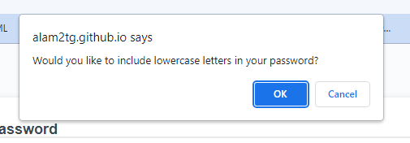
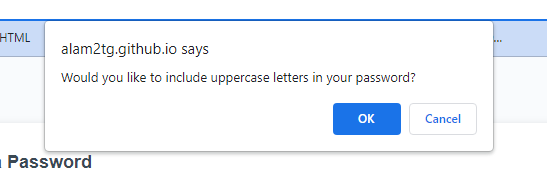
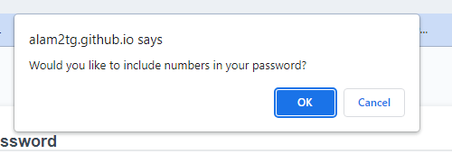
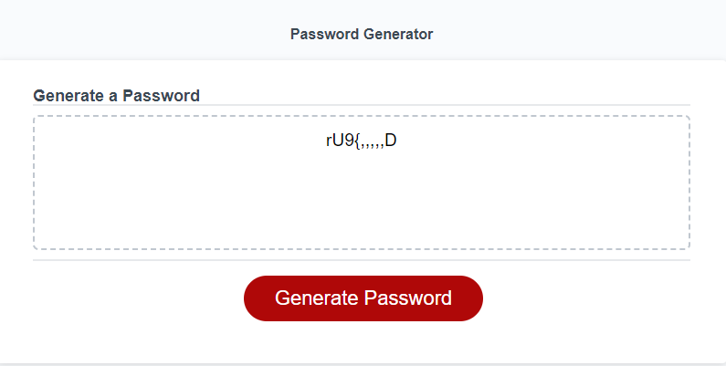

# Reverse Skull Key Password Generator
https://alam2tg.github.io/reverse-skull-key/

## Description

I built this project to see how difficult it was to make a password generator. I use a password manager myself, and I wanted to compare the results between my password generator, and theirs. Having this website will allow me to create unique passwords of my own whenever I choose. This will help keep my login information unique even when using the same email. I learned how make alogrithms by combining multiple javascript functions and their capabilities. Also, I learned that password generators are relatively easy to make, but not easy to perfect. I have been getting issues getting unique characters for my generated passwords. My project is unique because you can use the AsciiArray formula to include multiple symbols. This can be useful for people with different keyboard layouts outside of the English/US Keyboard layout. You can just use the same array function, find your characters on the ascii chart, and plug and place!

## Installation
To install my project, just go to the website "https://alam2tg.github.io/reverse-skull-key/", and generate a password!

## Usage
To use the password generator, the steps are as follows...
1. Click Generate Password
    - You will then answers the following window prompts...
2. Enter the length of your password (8-128 characters)
3. Click "Ok" if you would like to add the following...
    -Lowercase Letters
    -Uppercase Letters
    -Numbers
    -Special Characters
4. If you do not want to add the following characters, click "Cancel".
5. Your password is generated! You can use the password now, or Copy and Paste it somewhere for future use!

Screenshots for the process below! 

## Credits
Gumbo on StackOverflow
https://stackoverflow.com/questions/1497481/javascript-password-generator
